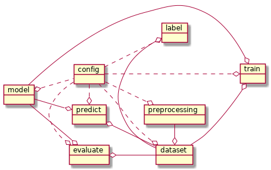

# zworkflow

Framework for configuration machine learning workflow.

## Quickstart

```bash
pip install git+https://github.com/zilleanai/zworkflow
echo 'domain: csv' > workflow.yml
zworkflow-train --config workflow.yml 
zworkflow-predict --config workflow.yml data.csv
```

## Structure

